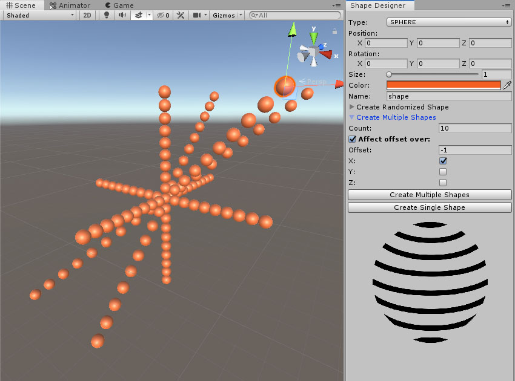

# Unity Editor Programming

After watching [the tutorial](https://www.pluralsight.com/courses/unity-editor-extending-custom-windows), I got more curious about the Unity's GUI and Editor features and how far I can extend it. I just can say WOW. It is amazing, how much free I am to use the tools and features it provides to create my own plugin.

### Final Result
The plugin covers:
- Defining the initial position, rotation, scale, color & name
- Create a shape by random, base on defined parameters
- Create multiple shapes w/ offset over X, Y or Z

### Technical Features
- Grouped sections
- Conrtolling the value's range
- Error/Message based on the values
- EditorGUILayout
	- Sapce
	- LabelField
	- TextField
	- IntField
	- FloatField
	- Vector3Field
	- ColorField
	- Slider
	- HelpBox
	- Toggle
	- Button

#### Other
- [GUILayout](https://docs.unity3d.com/ScriptReference/GUILayout.html)
- [EditorGUILayout](https://docs.unity3d.com/ScriptReference/EditorGUILayout.html)